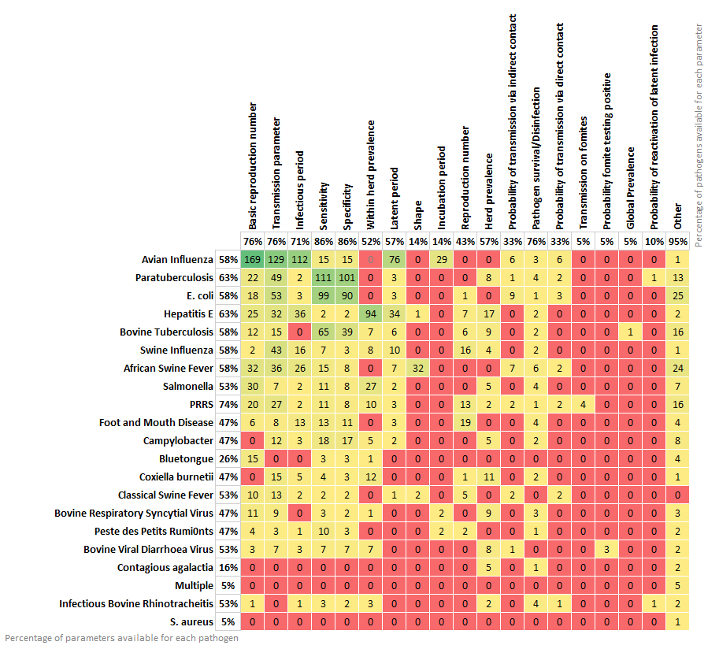

# PARAMETRA

Welcome to the PARAMETRA livestock disease transmission database. This database has been assembled by the BIOSECURE consortium to facilitate livestock disease transmission modelling.

## Overview

The PARAMETRA database is designed to be directly downloaded into programming environments such as R. It currently contains parameter values for up to 20 different livestock diseases, populated using a semi-systematic literature review.

For further information on methodology, please consult the accompanying publication [doi: XXXX - add when we submit to Biorxiv].



## Database Structure

The PARAMETRA database is subdivided by disease and by parameter. Parameters included in the database are:

1.  **Transmission**: Reproduction number, transmission parameter, probability of infection given direct/indirect contact, probability of reactivation of latent infection, other
2.  **Infectious/Latent/Incubation**: Infectious period, latent period, incubation period, shape, other
3.  **Pathogen survival**: Summary of relevant publications relating to pathogen survival on various surfaces and disinfection procedures
4.  **Diagnostic Test**: Specificity, sensitivity
5.  **Within Herd Prevalence**: Within herd prevalence
6.  **Regional Prevalence**: Herd prevalence, global prevalence
7.  **Control Plan**: Summary of relevant publications relating to voluntary or compulsory national and regional control plans
8.  **Other Relevant Information**: Summary of publications relevant for modelling
9.  **LOT (List of Terms)**: List of terms used in the database and their meanings
10. **Endemic pathogens**: List of endemic pathogens and parameter availability summary
11. **Epidemic pathogens**: List of epidemic pathogens and parameter availability summary
12. **AMR pathogens**: List of antimicrobial resistance pathogens and parameter availability summary

## Folders and Files

`data/` : Contains all parameter value data in separate .csv files and the full database as a single .xlsx file.

`outputs/`: Contains the matrix summarizing the database contents, in excel and csv format.

## Usage

The database and individual sheets can be downloaded directly into R or other programming environments. The database is designed to be used in the development of transmission models for livestock diseases.

**How to download parametra csv files in R**

1.  Go to the CSV file

2.  Click on the **raw** option present on the top right of the data

3.  Copy de link (it starts with [https://raw.githubusercontent.com/..](https://raw.githubusercontent.com/).)

To download just one table you can use the following code:

``` r
data<-read.csv("https://raw.githubusercontent.com/..")
```

To download and name multiple tables you can use the following code:

``` r
table_names<-c("Transmission", "InfectiousLatentIncubatperiod", "PathogenSurvival","DiagnosticTest","WithinHerdPrevalence", "RegionalPrevalence", "ControlPlan", "OtherRelevantInformation", "LOT", "ChangesLog", "Endemic_Pathogens", "Epidemic_Pathogens", "AMR_Pathogens")               

for(i in 1:lenght(table_names)){
  table_i<-read.csv(paste0("https://github.com/BIOSECURE-EU/parametra/blob/main/data/",table_names[i]))
  assign(table_names[i],table_i)
}
```

## Database Modification

The database can only be modified by administrators. If you wish to make a modification, notice an error, or would like to include an additional disease or parameter, please contact the administrators.

## License

[](https://www.gnu.org/licenses/gpl-3.0)

## Contact

-   Natalia Ciria Artiga: [Natalia.Ciria\@uab.cat](mailto:Natalia.Ciria@uab.cat)
-   Alistair Antonopoulos: [Alistair\@kreavet.com](mailto:Alistair@kreavet.com)
