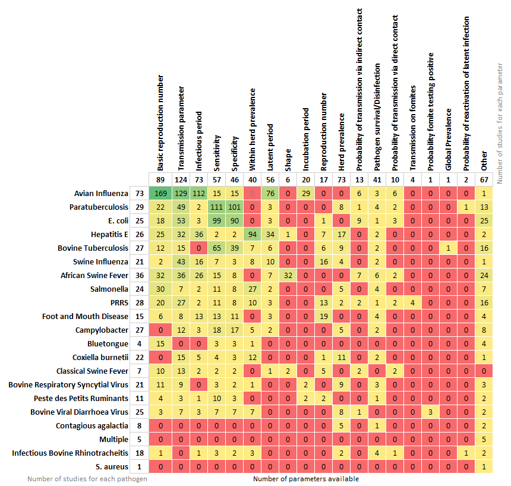

# PARAMETRA


A comprehensive database of livestock disease transmission parameters. Assembled by the [BIOSECURE](https://biosecure.eu/) consortium, this resource aims to support livestock disease transmission modelling.

## Overview

The PARAMETRA database is designed to be directly downloaded into programming environments such as R. It currently contains parameter values for up to 20 different livestock diseases, populated using a semi-systematic literature review.

For further information on methodology, please consult the accompanying publication [doi: XXXX - add when we submit to Biorxiv].



## Database Structure

The PARAMETRA database is subdivided by disease and by parameter. Parameters included in the database are:

1.  [**Transmission**](https://github.com/BIOSECURE-EU/parametra/blob/main/data/parametra_Transmission.csv): Reproduction number, transmission parameter, probability of infection given direct/indirect contact, probability of reactivation of latent infection, other
2.  [**Infectious/Latent/Incubation**](https://github.com/BIOSECURE-EU/parametra/blob/main/data/parametra_InfectiousLatentIncubatperiod.csv): Infectious period, latent period, incubation period, shape, other
3.  [**Pathogen survival**](https://github.com/BIOSECURE-EU/parametra/blob/main/data/parametra_PathogenSurvival.csv): Summary of relevant publications relating to pathogen survival on various surfaces and disinfection procedures
4.  [**Diagnostic Test**](https://github.com/BIOSECURE-EU/parametra/blob/main/data/parametra_DiagnosticTest.csv): Specificity, sensitivity
5.  [**Within Herd Prevalence**](https://github.com/BIOSECURE-EU/parametra/blob/main/data/parametra_WithinHerdPrevalence.csv): Within herd prevalence
6.  [**Regional Prevalence**](https://github.com/BIOSECURE-EU/parametra/blob/main/data/parametra_RegionalPrevalence.csv): Herd prevalence, global prevalence
7.  [**Control Plan**](https://github.com/BIOSECURE-EU/parametra/blob/main/data/parametra_ControlPlan.csv): Summary of relevant publications relating to voluntary or compulsory national and regional control plans
8.  [**Other Relevant Information**](https://github.com/BIOSECURE-EU/parametra/blob/main/data/parametra_OtherRelevantInformation.csv): Summary of publications relevant for modelling
9.  [**LOT (List of Terms)**](https://github.com/BIOSECURE-EU/parametra/blob/main/data/parametra_LOT.csv): List of terms used in the database and their meanings
10. [**Endemic pathogens**](https://github.com/BIOSECURE-EU/parametra/blob/main/data/parametra_Endemic_Pathogens.csv): List of endemic pathogens and parameter availability summary
11. [**Epidemic pathogens**](https://github.com/BIOSECURE-EU/parametra/blob/main/data/parametra_Epidemic_Pathogens.csv): List of epidemic pathogens and parameter availability summary
12. [**AMR pathogens**](https://github.com/BIOSECURE-EU/parametra/blob/main/data/parametra_AMR_Pathogens.csv): List of antimicrobial resistance pathogens and parameter availability summary

## Usage

### Installation as an R package 

``` r
# install.packages("devtools")
devtools::install_github("BIOSECURE-EU/parametra/tree/r-package")
```

### Excel File Access

Find the original Excel file in `data-raw/parametra.xlsx`

### URL Data Access

Access the database and individual sheets directly in R or other programming environments for livestock disease transmission modeling.

**Download CSV files in R**

1.  Navigate to the CSV file in `data-raw/tables`
2.  Click **raw** in the top right
3.  Copy the link (starting with [https://raw.githubusercontent.com/..](https://raw.githubusercontent.com/.))

Example: Download `parametra_long.csv` (containing all parameter tables) directly in R:

``` r
data<-read.csv("https://raw.githubusercontent.com/..")
```

Or in Python:

``` python
import pandas as pd

data = pd.read_csv("https://raw.githubusercontent.com/...")
```

## Database Modification

The database can only be modified by administrators. If you wish to make a modification, notice an error, or would like to include an additional disease or parameter, please contact the administrators.

## Contact

-   Natalia Ciria Artiga: [Natalia.Ciria\@uab.cat](mailto:Natalia.Ciria@uab.cat)
-   Alistair Antonopoulos: [Alistair\@kreavet.com](mailto:Alistair@kreavet.com)

## License


## Acknowledgments

This open source software code was developed the BIOSECURE Project, funded from the European Union’s HORIZON Europe FARM2FORK project.
