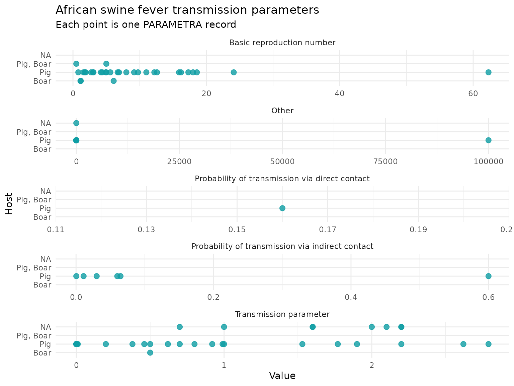
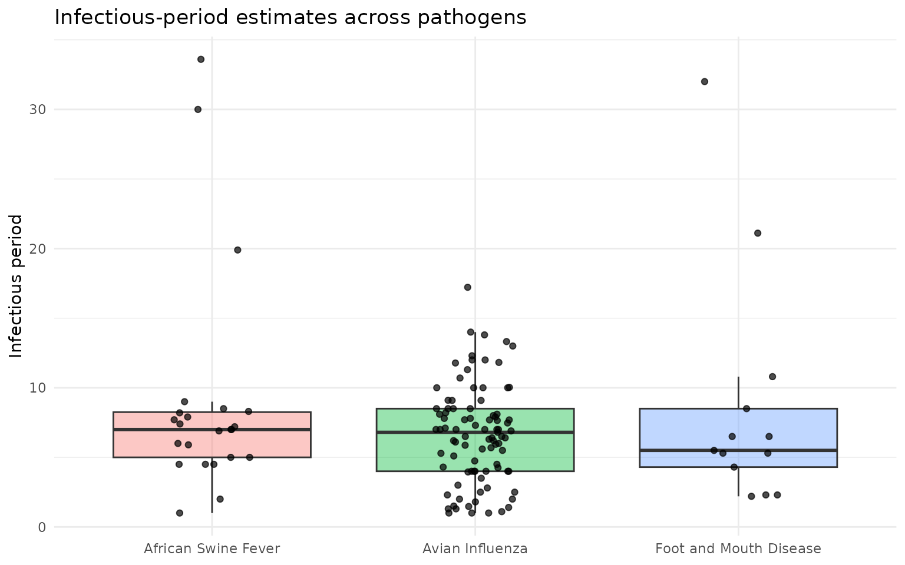

# Getting started with PARAMETRA

## Introduction

PARAMETRA is an R data package containing curated parameters for
livestock disease modelling. The package includes one combined dataset,
`parametra_long`, plus one dataset per parameter group.

## Installation

``` r

# Install from GitHub
# install.packages("remotes")
remotes::install_github("BIOSECURE-EU/parametra")
```

``` r

library(parametra)
library(dplyr)
library(ggplot2)
library(tidyr)
```

## Data included in the package

The main dataset is `parametra_long`, which stacks all parameter-group
tables into a single analysis-ready table. The column `parameter_type`
identifies the original parameter group.

A quick overview of the number of records by parameter group:

``` r

parametra_long %>%
  count(parameter_type, sort = TRUE)
```

    ## # A tibble: 8 × 2
    ##   parameter_type                      n
    ##   <chr>                           <int>
    ## 1 transmission                     1076
    ## 2 diagnostic_test                   721
    ## 3 infectious_latent_incuba_period   420
    ## 4 within_herd_prevalence            175
    ## 5 regional_prevalence                92
    ## 6 pathogen_survival                  48
    ## 7 other                              22
    ## 8 control_plan                        9

And the number of records by pathogen:

``` r

parametra_long %>%
  count(pathogen, sort = TRUE)
```

    ## # A tibble: 24 × 2
    ##    pathogen                   n
    ##    <chr>                  <int>
    ##  1 Avian Influenza          577
    ##  2 Paratuberculosis         313
    ##  3 E. coli                  300
    ##  4 Hepatitis E              248
    ##  5 African Swine Fever      186
    ##  6 Bovine Tuberculosis      177
    ##  7 PRRS                     120
    ##  8 Swine Influenza          109
    ##  9 Salmonella               102
    ## 10 Foot and Mouth Disease    79
    ## # ℹ 14 more rows

## Finding relevant records

Most analyses start by filtering `parametra_long`. For example, the code
below finds African swine fever transmission records with an available
numeric value.

``` r

asf_transmission <- parametra_long %>%
  filter(
    pathogen == "African Swine Fever",
    parameter_type == "transmission",
    !is.na(value)
  )
```

Use [`distinct()`](https://dplyr.tidyverse.org/reference/distinct.html)
to see which values are available before filtering:

``` r

parametra_long %>%
  distinct(parameter_type, parameter) %>%
  arrange(parameter_type, parameter) %>%
  head(20)
```

    ## # A tibble: 20 × 2
    ##    parameter_type                  parameter                                    
    ##    <chr>                           <chr>                                        
    ##  1 control_plan                    NA                                           
    ##  2 diagnostic_test                 Sensitivity                                  
    ##  3 diagnostic_test                 Specificity                                  
    ##  4 infectious_latent_incuba_period Incubation period                            
    ##  5 infectious_latent_incuba_period Infectious period                            
    ##  6 infectious_latent_incuba_period Latent period                                
    ##  7 infectious_latent_incuba_period Other                                        
    ##  8 infectious_latent_incuba_period Shape                                        
    ##  9 other                           Other                                        
    ## 10 pathogen_survival               Fomites transmission                         
    ## 11 pathogen_survival               Survival/Disinfection                        
    ## 12 regional_prevalence             Global Prevalence                            
    ## 13 regional_prevalence             Herd prevalence                              
    ## 14 regional_prevalence             Other                                        
    ## 15 transmission                    Basic reproduction number                    
    ## 16 transmission                    Other                                        
    ## 17 transmission                    Probability of reactivation of latent infect…
    ## 18 transmission                    Probability of transmission between farms    
    ## 19 transmission                    Probability of transmission via direct conta…
    ## 20 transmission                    Probability of transmission via indirect con…

## Example 1: Transmission parameters for African swine fever

This example plots transmission-parameter values for African swine
fever, faceted by parameter. The record `id` is kept in the plotting
data so the source row can be traced back to PARAMETRA.

``` r

asf_transmission %>%
  ggplot(aes(x = value, y = host)) +
  geom_point(color = "#0F9DA4", size = 2.5, alpha = 0.8) +
  facet_wrap(~ parameter, ncol = 1, scales = "free_x") +
  labs(
    title = "African swine fever transmission parameters",
    subtitle = "Each point is one PARAMETRA record",
    x = "Value",
    y = "Host"
  ) +
  theme_minimal()
```



## Example 2: Comparing infectious periods across pathogens

Here we compare infectious-period estimates for three pathogens. This
example is useful for checking the range of values before selecting
parameters for a model.

``` r

infectious_periods <- parametra_long %>%
  filter(
    parameter == "Infectious period",
    pathogen %in% c("Foot and Mouth Disease", "African Swine Fever", "Avian Influenza"),
    !is.na(value)
  )
ggplot(infectious_periods, aes(x = pathogen, y = value, fill = pathogen)) +
  geom_boxplot(outlier.shape = NA, alpha = 0.4) +
  geom_jitter(width = 0.15, height = 0, alpha = 0.7, size = 1.5) +
  labs(
    title = "Infectious-period estimates across pathogens",
    x = NULL,
    y = "Infectious period"
  ) +
  theme_minimal() +
  theme(legend.position = "none")
```



## Working with references

Each record includes reference fields so parameter values can be traced
to their source. Useful columns include:

- `ref`: DOI, DOI URL, PubMed URL, or stable web URL

- `ref_short`: short human-readable citation, when available

- `ref_status`: status assigned during PARAMETRA curation

- `ref_last_access`: date when a URL reference was last checked.

``` r

parametra_long %>%
  count(ref_status, sort = TRUE)
```

    ## # A tibble: 3 × 2
    ##   ref_status        n
    ##   <chr>         <int>
    ## 1 doi_found      2530
    ## 2 url_unchecked    32
    ## 3 doi_not_found     1

## Interpreting PARAMETRA data

PARAMETRA is curated to support disease-modelling work, but users should
still assess whether each record is appropriate for their specific
modelling context. Before accepting a parameter value as suitable, we
recommend reviewing the contextual information and notes provided in the
database, and consulting the original reference.

## Contributing new records

New records can be submitted through the [PARAMETRA submission
form](https://ec.europa.eu/eusurvey/runner/parametra-submission) or via
<contact@parametra.eu>.
